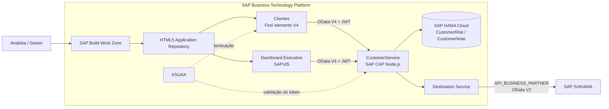
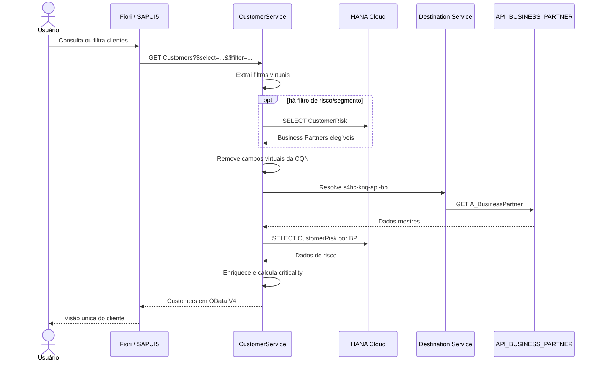
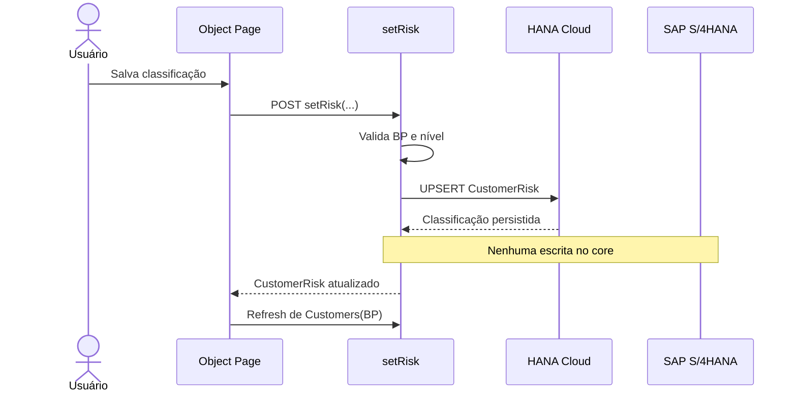

# Porto Seguro — Extensão de Clientes e Risco com SAP Clean Core

> Uma extensão side-by-side no SAP BTP que combina Business Partners do SAP S/4HANA com classificação de risco e histórico de interações próprios da Porto Seguro — sem levar essas customizações para dentro do core do ERP.

## Era uma vez um cliente com duas histórias

Imagine que uma analista da Porto Seguro começa o dia olhando sua carteira de clientes.

Para saber **quem é o cliente**, ela precisa dos dados corporativos confiáveis: código, nome, agrupamento, tipo, setor e data de criação. Essa é a história que o **SAP S/4HANA** já conhece e governa por meio do Business Partner.

Mas, para decidir **como cuidar desse cliente**, falta outra história:

- o nível de risco atual;
- o motivo da classificação;
- o segmento de seguro relacionado;
- quem é responsável pela análise;
- quando o caso deve ser revisto;
- quais contatos e compromissos já foram registrados.

Essas informações fazem parte do contexto específico da Porto Seguro. Colocá-las diretamente no S/4HANA aumentaria o acoplamento com o ERP e ampliaria o impacto de upgrades. Mantê-las isoladas, por outro lado, não deveria obrigar o usuário a consultar vários sistemas.

Este projeto resolve o dilema reunindo as duas histórias em uma única experiência SAP Fiori:

1. o S/4HANA continua sendo o **system of record** do Business Partner;
2. a extensão no SAP BTP mantém somente os dados diferenciais de risco e interação;
3. um serviço SAP CAP compõe as duas fontes em tempo de execução;
4. as aplicações exibem uma visão unificada, sem replicar a responsabilidade funcional do core.

---

## O projeto em uma frase

Uma aplicação full-stack no SAP BTP, construída com **SAP CAP Node.js**, **SAP Fiori elements/SAPUI5**, **SAP HANA Cloud**, **Destination Service**, **XSUAA**, **HTML5 Application Repository** e **SAP Build Work Zone**, que enriquece a API nativa `API_BUSINESS_PARTNER` do S/4HANA com dados locais de risco.

## O que o usuário recebe

O repositório entrega duas aplicações HTML5:

| Aplicação | Tecnologia | Objetivo |
|---|---|---|
| **Clientes** | SAP Fiori elements V4 — List Report + Object Page | Consultar a carteira, filtrar clientes, abrir detalhes e visualizar o perfil de risco enriquecido |
| **Dashboard Executivo** | SAPUI5 freestyle | Apresentar uma visão gerencial da classificação de risco da carteira |

A aplicação **Clientes** segue o fluxo natural de drill-down do Fiori:

- o **List Report** apresenta os Business Partners e o risco enriquecido;
- a **Object Page** reúne informações gerais e perfil de risco;
- uma seção customizada exibe os dados específicos da extensão;
- o backend expõe a ação `setRisk` e a entidade `CustomerNotes` para evolução da experiência transacional.

## Clean Core aplicado na prática

Clean Core não significa “não estender”. Significa estender de forma deliberada, usando contratos estáveis e reduzindo o impacto sobre o núcleo do ERP.

Neste projeto, o princípio aparece nas decisões abaixo:

| Princípio | Aplicação no projeto |
|---|---|
| **Usar API publicada** | Os dados mestres vêm da API SAP `API_BUSINESS_PARTNER`, modelada como serviço externo CAP |
| **Não modificar o core** | Risco e notas não são gravados em tabelas ou objetos customizados dentro do S/4HANA |
| **Extensão side-by-side** | Modelo, regras, persistência e UI da extensão vivem no SAP BTP |
| **Separar responsabilidades** | S/4HANA governa Business Partner; a extensão governa `CustomerRisk` e `CustomerNote` |
| **Acoplar por contrato** | O CAP consome a API por Destination Service, sem URL ou credencial embutida no código |
| **Experiência unificada** | O usuário recebe dados de duas origens por um único serviço OData V4 e uma única UI |
| **Evolução independente** | A regra de risco pode mudar sem transportar uma modificação para o core do ERP |

### O que permanece no core e o que fica na extensão

| Origem | Dados | Operações realizadas por este projeto |
|---|---|---|
| SAP S/4HANA | Business Partner, nome, agrupamento, tipo, setor, cliente e datas cadastrais | **Leitura** pela API nativa |
| SAP BTP / HANA Cloud | Nível e motivo de risco, segmento, responsável, revisão | Leitura e upsert por `CustomerRisk` |
| SAP BTP / HANA Cloud | Notas, tipo de interação, follow-up e status de resolução | Leitura e criação por `CustomerNote` |

> A ação de classificar risco não atualiza o Business Partner no S/4HANA. Ela escreve exclusivamente na persistência da extensão.

---

## Arquitetura



### Componentes BTP

| Componente | Papel na solução |
|---|---|
| **Cloud Foundry Runtime** | Executa o backend CAP Node.js |
| **SAP HANA Cloud / HDI existente** | Persiste os dados próprios da extensão |
| **Destination Service** | Resolve a conexão com o backend CAP para apps HTML5 e com a API remota pelo binding do serviço |
| **XSUAA** | Autentica usuários e valida tokens JWT |
| **HTML5 Application Repository** | Armazena e serve os artefatos das aplicações `clientes` e `dashboard` |
| **SAP Build Work Zone** | Descobre os inbounds e publica as aplicações em uma experiência central |

### Contratos expostos pelo CAP

O `CustomerService`, disponível em `/odata/v4/porto-seguro`, expõe:

| Contrato | Tipo | Origem |
|---|---|---|
| `Customers` | Entidade somente leitura | Projeção da API remota, enriquecida em runtime |
| `CustomerRisks` | Entidade | Projeção de `com.portoseguro.CustomerRisk` |
| `CustomerNotes` | Entidade | Projeção de `com.portoseguro.CustomerNote` |
| `RiskLevelVH`, `SegmentVH`, `GroupingVH` | Entidades somente leitura | Value helps locais |
| `setRisk(...)` | Ação não vinculada | Upsert da classificação local |

---

## O encontro entre a API do S/4HANA e a extensão de Risco

Esta é a parte central da solução.

### 1. A API remota entra como um serviço externo CAP

O arquivo `srv/external/API_BUSINESS_PARTNER.cds` declara `API_BUSINESS_PARTNER` com `@cds.external` e contém a entidade `A_BusinessPartner`.

O projeto mantém apenas o subconjunto de campos necessário à demonstração:

```cds
@cds.external
service API_BUSINESS_PARTNER {
  entity A_BusinessPartner {
    key BusinessPartner         : String(10);
        BusinessPartnerFullName : String(81);
        BusinessPartnerGrouping : String(4);
        BusinessPartnerType     : String(2);
        Industry                : String(10);
        CreationDate            : Date;
        Customer                : String(10);
  }
}
```

No `package.json`, o contrato é configurado como OData V2. Nos perfis `hybrid` e `production`, o CAP procura o destino BTP `s4hc-knq-api-bp`:

```json
"API_BUSINESS_PARTNER": {
  "kind": "odata-v2",
  "model": "srv/external/API_BUSINESS_PARTNER",
  "[production]": {
    "credentials": {
      "destination": "s4hc-knq-api-bp"
    }
  }
}
```

Assim, URL e mecanismo de autenticação ficam fora do código. Eles pertencem à configuração segura do destino.

> **Produção:** o modelo externo deste repositório é intencionalmente reduzido. Em um cenário produtivo, ele deve ser gerado a partir do metadata oficial e vigente do sistema alvo, por exemplo com `cds import API_BUSINESS_PARTNER.edmx`, e versionado como contrato externo.

### 2. `Customers` projeta o core e declara os campos da extensão como virtuais

Em `srv/service.cds`, `Customers` é uma projeção somente leitura sobre `ext.A_BusinessPartner`. Os dados de risco aparecem como campos `virtual`:

```cds
@readonly
entity Customers as projection on ext.A_BusinessPartner {
  key BusinessPartner,
      BusinessPartnerFullName,
      BusinessPartnerGrouping,
      BusinessPartnerType,
      Industry,
      CreationDate,
      Customer,
      virtual null as riskLevel            : String(10),
      virtual null as riskLevelCriticality : Integer,
      virtual null as segment              : String(30),
      virtual null as riskReason           : String(500),
      virtual null as owner                : String(100),
      virtual null as reviewDate           : Date
}
```

“Virtual” é uma escolha importante: esses elementos fazem parte do contrato OData da extensão, mas não são colunas da entidade remota e não devem ser enviados ao S/4HANA.

### 3. Os dados diferenciais têm persistência própria

`db/schema.cds` modela a classificação com a chave natural do Business Partner:

```cds
entity CustomerRisk : managed {
  key businessPartner : String(10);
      riskLevel       : String(10) enum { BAIXO; MEDIO; ALTO; CRITICO; };
      riskReason      : String(500);
      segment         : String(30) enum {
        AUTO; SAUDE; VIDA; RESIDENCIAL; EMPRESARIAL;
      };
      owner           : String(100);
      reviewDate      : Date;
}
```

O aspecto `managed` acrescenta automaticamente campos de criação e alteração. As interações são armazenadas separadamente em `CustomerNote`, com UUID, auditoria, tipo, texto, follow-up e indicador de resolução.

Não há replicação integral do Business Partner: a extensão guarda apenas a chave necessária para correlacionar as duas fontes.

### 4. Antes de consultar o S/4HANA, o handler separa o que cada fonte entende

Uma requisição do Fiori pode selecionar e filtrar simultaneamente campos do core e da extensão. O S/4HANA, porém, não conhece `riskLevel`, `segment`, `owner` ou os demais campos virtuais.

O handler de `READ Customers` em `srv/service.js` executa três preparações:

1. clona a CQN recebida para não alterar inadvertidamente a requisição original;
2. extrai os filtros de igualdade aplicados aos campos virtuais;
3. remove campos virtuais de `$select`, `$filter` e `$orderby` antes da chamada remota.

Em forma simplificada:

```js
const riskFilters = _extractVirtualEquals(req.query.SELECT.where);
const query = _stripVirtualFields(req.query);
const S4 = await cds.connect.to("API_BUSINESS_PARTNER");
const businessPartners = await S4.run(query);
```

Essa separação evita enviar para `A_BusinessPartner` um contrato que só existe na extensão.

### 5. Filtros de risco são resolvidos localmente e convertidos em filtro de Business Partner

Quando a lista recebe um filtro como `riskLevel eq 'ALTO'`, o CAP consulta primeiro `CustomerRisk` na base local. O resultado fornece os códigos de Business Partner compatíveis.

Essas chaves são então incorporadas à consulta remota como um predicado sobre `BusinessPartner`. O efeito é um *semi-join* entre fontes, orquestrado no serviço:

```text
riskLevel = ALTO
       │
       ▼
CustomerRisk local ──► [BP-01, BP-07, BP-19]
                              │
                              ▼
API_BUSINESS_PARTNER com BusinessPartner IN (...)
```

O projeto suporta filtros de igualdade para `riskLevel`, `segment`, `riskReason`, `owner` e `reviewDate`. Filtros normais, como agrupamento e código de Business Partner, seguem para a API remota.

### 6. Paginação e priorização são preservadas na composição

O handler respeita `$top` e `$skip`. Em produção, existe também uma lista explícita de Business Partners priorizados para a demonstração.

Para que eles apareçam no início **global** da coleção — e não no início de todas as páginas — o algoritmo:

1. lê individualmente os BPs prioritários que atendem aos filtros;
2. preserva a ordem configurada;
3. exclui esses códigos da consulta regular para evitar duplicação;
4. calcula quanto da página já foi ocupado e ajusta `$top`/`$skip` da consulta restante;
5. combina os dois conjuntos.

Leituras singleton da Object Page são tratadas separadamente. Isso impede que a lógica de prioridade altere o comportamento de `Customers('<BusinessPartner>')` e garante que o detalhe correto seja retornado.

> A priorização é uma regra específica da demonstração, não um requisito do padrão Clean Core. Em produção, uma ordenação de negócio deve ser formalizada, testada e preferencialmente dirigida por configuração ou dados.

### 7. O CAP enriquece cada registro com o estado local

Depois da resposta do S/4HANA, o handler carrega as classificações correspondentes, cria um mapa por `businessPartner` e compõe o resultado:

```text
A_BusinessPartner                   CustomerRisk
┌────────────┬───────────────┐      ┌────────────┬───────────┐
│ BP         │ Nome          │      │ BP         │ Risco     │
├────────────┼───────────────┤      ├────────────┼───────────┤
│ 0000000001 │ Cliente A     │  +   │ 0000000001 │ ALTO      │
└────────────┴───────────────┘      └────────────┴───────────┘
                     │
                     ▼
Customers OData V4
┌────────────┬───────────────┬───────────┬──────────┐
│ BP         │ Nome          │ riskLevel │ segment  │
├────────────┼───────────────┼───────────┼──────────┤
│ 0000000001 │ Cliente A     │ ALTO      │ AUTO     │
└────────────┴───────────────┴───────────┴──────────┘
```

Além dos valores textuais, `riskLevelCriticality` é calculado para a semântica visual do Fiori:

| Nível | Criticality OData | Interpretação visual |
|---|---:|---|
| `BAIXO` | `3` | Positivo |
| `MEDIO` | `2` | Atenção |
| `ALTO` | `1` | Negativo |
| `CRITICO` | `1` | Negativo |
| sem classificação | `0` | Neutro |

### 8. `setRisk` altera somente a extensão

O serviço expõe a ação OData V4 não vinculada `setRisk`. O repositório também contém, em `ObjectPageExtension.controller.js`, um exemplo de consumo pelo OData V4 Model:

```js
const action = oModel.bindContext("/setRisk(...)");
action.setParameter("businessPartner", businessPartner);
action.setParameter("riskLevel", riskLevel);
// demais parâmetros...
await action.execute();
```

No backend, a ação valida os dados essenciais e executa um `UPSERT` em `com.portoseguro.CustomerRisk`:

```js
await db.run(
  UPSERT.into("com.portoseguro.CustomerRisk").entries({
    businessPartner,
    riskLevel,
    riskReason,
    segment,
    owner,
    reviewDate
  })
);
```

Nenhum `UPDATE` ou `PATCH` é enviado à `API_BUSINESS_PARTNER`. Após a ação, uma nova leitura de `Customers` retorna o Business Partner com o novo enriquecimento.

> No `manifest.json` atual, a controller extension não está registrada. Assim, a ação está implementada e disponível no backend, mas o botão/fluxo de gravação não faz parte da Object Page efetivamente carregada nesta versão.

### Sequência completa de leitura



### Sequência de atualização do risco



---

## Experiência Fiori

As anotações em `srv/service.cds` definem:

- `UI.HeaderInfo` para identidade do cliente;
- `UI.LineItem` para as colunas do List Report;
- `UI.SelectionFields` para filtros;
- `UI.Facets` e `UI.FieldGroup` para informações gerais e perfil de risco;
- value helps fixos para agrupamento, nível de risco e segmento;
- criticality semântica para o status de risco.

O `app/clientes/webapp/manifest.json` configura:

- List Report em `/Customers` com tabela responsiva;
- navegação para a Object Page pelo mesmo contexto;
- seção customizada `RiskClassificationSection`;
- inbound `Clientes-manage` para descoberta no Work Zone;
- OData V4 em `odata/v4/porto-seguro/`.

A controller extension também registra e carrega `CustomerNotes` em ordem decrescente de criação. Essas notas pertencem à extensão e não alteram o cadastro mestre.

No estado atual, essa controller extension e o fragmento `InteractionNotes.fragment.xml` existem no código-fonte, mas não estão conectados ao `manifest.json`. A experiência publicada exibe o risco; a edição e as notas permanecem como capacidades de backend e artefatos preparados para integração futura.

---

## Segurança

### Fluxo implementado

1. As rotas das aplicações HTML5 usam `authenticationType: xsuaa`.
2. O destino interno `ps-customer-ext-srv` usa `HTML5.ForwardAuthToken: true`.
3. O JWT do usuário é encaminhado ao CAP.
4. Em produção, o CAP usa `auth.kind: xsuaa` para validar o token.
5. Credenciais da API remota ficam no Destination Service, não no repositório.

O `xs-security.json` declara:

| Role template | Scopes incluídos | Intenção |
|---|---|---|
| `CustomerViewer` | `CustomerViewer` | Consulta da carteira e do perfil de risco |
| `CustomerEditor` | `CustomerViewer`, `CustomerEditor` | Gestão de risco e interações |

### Atenção: autorização ainda não está aplicada no serviço

Os scopes e role templates existem, mas o `CustomerService` ainda não possui anotações `@requires` ou `@restrict`. Portanto, o estado atual fornece **autenticação**, mas não garante no backend a separação funcional entre Viewer e Editor.

Antes de uso produtivo, aplique least privilege no CAP, por exemplo:

- leitura de `Customers` e `CustomerRisks` para `CustomerViewer`;
- `setRisk` e escrita em `CustomerNotes` somente para `CustomerEditor`;
- revisão das permissões genéricas de CRUD das projeções locais;
- testes negativos de autorização, além dos controles visuais na UI.

Controles de tela nunca substituem autorização no backend.

---

## Modos de execução

| Perfil | Business Partners | Persistência | Autenticação |
|---|---|---|---|
| Desenvolvimento padrão | Mock em memória definido em `srv/service.js` | SQLite | Dummy auth |
| `hybrid` | API remota pelo destino `s4hc-knq-api-bp` | Conforme bindings/configuração híbrida | Conforme bindings |
| `production` | API remota pelo destino `s4hc-knq-api-bp` | SAP HANA Cloud | XSUAA |

O mock local permite desenvolver sem depender permanentemente do S/4HANA. Ele não substitui testes de contrato e integração com a API real.

## Executar localmente

### Pré-requisitos

- Node.js 20 ou superior;
- npm;
- SAP CDS CLI disponível pelo projeto (`@sap/cds-dk`);
- acesso de rede apenas se o perfil híbrido for usado.

### Instalação e inicialização

```bash
git clone https://github.com/marcelofiorito/demo_porto_seguro.git
cd demo_porto_seguro
npm ci
npm run dev
```

`npm run dev` executa `cds watch`. No perfil padrão, o backend usa os Business Partners mockados e a persistência SQLite de desenvolvimento. Os CSVs em `db/data/` fornecem dados iniciais das entidades locais.

O CAP lista no terminal as URLs disponíveis para os serviços e aplicações. O endpoint principal é:

```text
/odata/v4/porto-seguro/
```

### Build de produção

```bash
npm run build:cf
```

Esse script executa `cds build --production` e gera os artefatos CAP em `gen/`.

---

## Deploy no SAP BTP

O `mta.yaml` empacota:

- `ps-customer-ext-srv`: aplicação CAP Node.js;
- `ps-customer-ext-clientes`: aplicação Fiori elements;
- `ps-customer-ext-dashboard`: aplicação SAPUI5;
- `ps-customer-ext-appcontent`: conteúdo para o HTML5 Application Repository;
- `ps-customer-ext-destinationcontent`: destinos de integração dos apps;
- instâncias de XSUAA, Destination Service e HTML5 Application Repository.

### Pré-requisitos externos ao MTA

O descritor pressupõe que estes recursos já existam ou sejam configurados fora dele:

1. serviço HANA/HDI chamado `ps-customer-ext-db`, declarado como `org.cloudfoundry.existing-service`;
2. destino BTP `s4hc-knq-api-bp`, com URL e autenticação válidas para a API do S/4HANA;
3. entitlement/subscrição e configuração do SAP Build Work Zone;
4. role collections atribuídas aos usuários;
5. target correto de Cloud Foundry e ferramentas `mbt`/`cf` instaladas.

O MTA atual não contém módulo `hdb` de deploy. Portanto, a preparação/migração do schema na instância HANA existente precisa estar resolvida pelo processo operacional adotado pelo ambiente.

### Build e deploy

```bash
mbt build
cf deploy mta_archives/porto-seguro-customer-ext-backend_1.0.0.mtar
```

Após o deploy:

1. valide o estado da aplicação CAP e seus bindings;
2. valide o acesso ao destino `s4hc-knq-api-bp`;
3. confirme que os apps aparecem no HTML5 Application Repository;
4. atualize/sincronize o content provider no Work Zone;
5. atribua os conteúdos a roles e publique-os no site/workpage apropriado;
6. teste leitura, classificação, notas e um cenário de acesso não autorizado.

---

## Estrutura do projeto

```text
.
├── app/
│   ├── clientes/                  # Fiori elements: List Report + Object Page
│   │   ├── webapp/manifest.json
│   │   ├── webapp/ext/            # Fragmentos e controller extension
│   │   └── xs-app.json            # Rotas para OData e HTML5 repo
│   └── dashboard/                 # Dashboard SAPUI5 freestyle
├── db/
│   ├── schema.cds                 # CustomerRisk, CustomerNote e value helps
│   └── data/                      # Dados iniciais de desenvolvimento/demo
├── srv/
│   ├── external/
│   │   └── API_BUSINESS_PARTNER.cds
│   ├── service.cds                # Contrato OData V4 e anotações Fiori
│   └── service.js                 # Federação, enriquecimento e ações
├── mta.yaml                       # Build e deploy Cloud Foundry/HTML5
├── package.json                   # Runtime CAP e perfis
└── xs-security.json               # Scopes e role templates XSUAA
```

## Tecnologias e versões declaradas

| Camada | Tecnologia |
|---|---|
| Runtime | Node.js `>=20` |
| Backend | SAP CAP Node.js `@sap/cds ^10.0.5` |
| Persistência local | SQLite |
| Persistência produtiva | SAP HANA Cloud via `@cap-js/hana` |
| Serviço remoto | OData V2 `API_BUSINESS_PARTNER` |
| API da extensão | OData V4 |
| Frontend | SAPUI5 `1.139.0`, Fiori elements V4 e freestyle |
| Segurança | XSUAA / JWT |
| Deploy | MTA no Cloud Foundry |

---

## Decisões e limites atuais

Este repositório é uma demonstração funcional e deixa alguns pontos explícitos para não confundir uma prova de conceito com um blueprint produtivo completo:

1. **Contrato externo reduzido:** o modelo da API contém apenas os campos usados pela demo; produção deve importar e controlar o metadata oficial.
2. **Autorização incompleta:** scopes existem, mas ainda precisam ser aplicados com `@requires`/`@restrict` no CAP.
3. **Priorização de BPs codificada:** a ordem especial em `service.js` serve à narrativa da demo e deve ser substituída por uma regra governada, se virar requisito real.
4. **Mock em código:** útil para desenvolvimento local, mas testes produtivos precisam validar contrato, autenticação, paginação e erros contra o S/4HANA.
5. **Sem deployer HANA no MTA:** a instância `ps-customer-ext-db` é existente e seu ciclo de schema deve ser administrado separadamente.
6. **Sem cache de dados mestres:** a leitura é composta em runtime; volume, latência, limites do serviço remoto e estratégia de resiliência devem ser medidos para o SLA real.
7. **Filtros virtuais específicos:** o parser atual trata igualdades nos campos de risco. Operadores adicionais exigem desenho e testes próprios.
8. **CSRF desativado nas rotas OData dos apps:** antes da produção, reavalie a configuração para operações de escrita e valide a proteção ponta a ponta adotada pelo runtime.
9. **Controller extension não registrada:** `setRisk` e `CustomerNotes` existem no backend, porém os artefatos de interação da Object Page não estão conectados no manifest atual.
10. **Warnings no build das anotações:** o compilador reporta `UI.DataFieldWithCriticality` como tipo desconhecido em `UI.LineItem` e `UI.FieldGroup`; as anotações devem ser revisadas para o tipo suportado antes da produção.

## Próximos passos recomendados para produção

- aplicar autorização backend com least privilege;
- importar o EDMX real e adicionar testes de contrato da API remota;
- incluir testes automatizados para enriquecimento, filtros, paginação, singleton e `setRisk`;
- formalizar migrações/deploy do schema HANA;
- configurar observabilidade, correlação de logs, métricas e tracing;
- definir timeout, retry e circuit breaker somente para operações idempotentes e conforme o SLA;
- remover a priorização hardcoded ou externalizá-la;
- revisar proteção CSRF, CORS, auditoria e retenção dos dados de interação;
- validar requisitos de privacidade e LGPD para textos livres em notas e motivos de risco;
- executar testes de carga para evitar consultas N+1 ou listas `IN` excessivas em grandes volumes.

---

## Por que esta arquitetura importa

A solução não tenta transformar o SAP BTP em um segundo S/4HANA. Ela preserva uma fronteira clara:

- o **core** continua íntegro e responsável pelos dados mestres;
- a **extensão** contém somente o diferencial de negócio;
- a **API publicada** é o contrato entre os dois mundos;
- o **CAP** transforma fontes separadas em uma experiência coerente;
- o **Fiori** apresenta ao usuário uma única história do cliente.

Esse é o valor prático do Clean Core neste cenário: inovar no ritmo da Porto Seguro sem transferir toda inovação para o ciclo de vida do ERP.